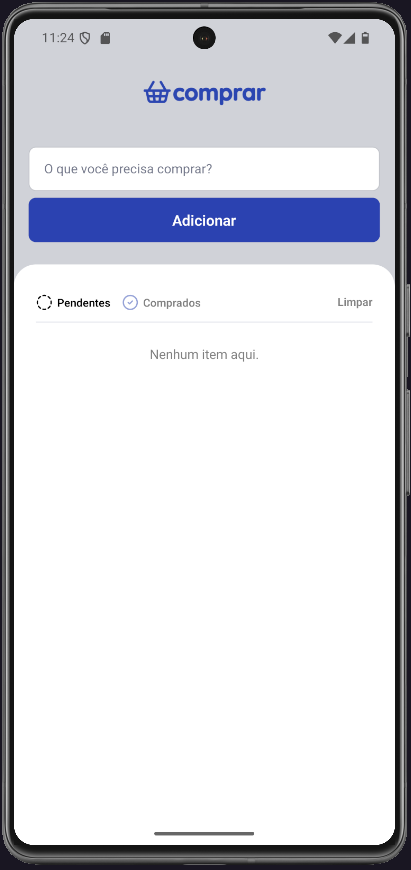
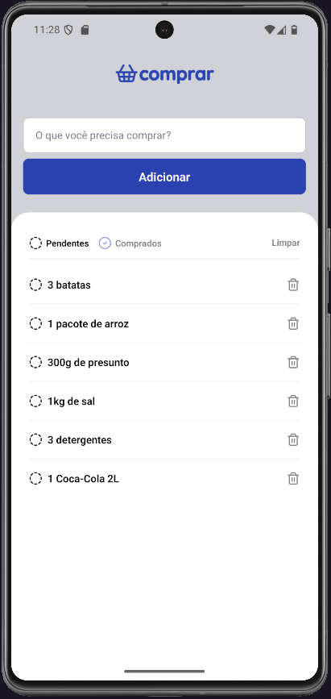
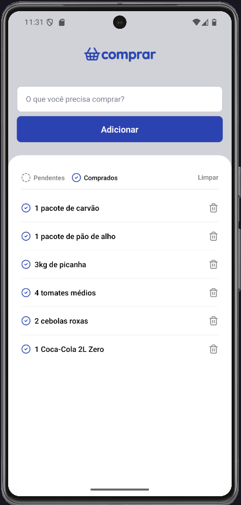

# 🛒 Comprar - Lista de Compras

Um aplicativo simples feito em **React Native + Expo** para gerenciar listas de compras.  
Você pode adicionar itens, marcar como **pendentes** ou **comprados**, além de limpar a lista facilmente.  

---

## ✨ Funcionalidades
- Adicionar novos itens à lista de compras.
- Separar itens em **Pendentes** e **Comprados**.
- Remover itens individualmente.
- Limpar toda a lista de uma vez.

---

## 📱 Telas
Abaixo estão as telas do aplicativo:

### Tela inicial (sem itens)


### Lista com itens pendentes


### Lista de itens comprados


---

## 🚀 Tecnologias
- [React Native](https://reactnative.dev/)  
- [Expo](https://expo.dev/)  

---

## ⚙️ Pré-requisitos
Antes de começar, você precisa ter instalado na sua máquina:
- [Node.js](https://nodejs.org/)  
- [Expo CLI](https://docs.expo.dev/get-started/installation/)  
- [Git](https://git-scm.com/)  

---

## 🛠️ Como rodar o projeto

Clone o repositório:
```bash
git clone https://github.com/mathpimentel/App-comprar.git
```
Entre na pasta do projeto:
```bash
cd App-comprar
```
Instale as dependências:
```bash
npm install
```
Inicie o projeto com Expo:
```bash
npx expo start
```

▶️ Executando no celular **(Expo Go)**

- Baixe o aplicativo Expo Go (disponível na Play Store ou App Store).
- Escaneie o QR Code exibido no terminal ou no navegador.
- O app abrirá automaticamente no seu dispositivo.
